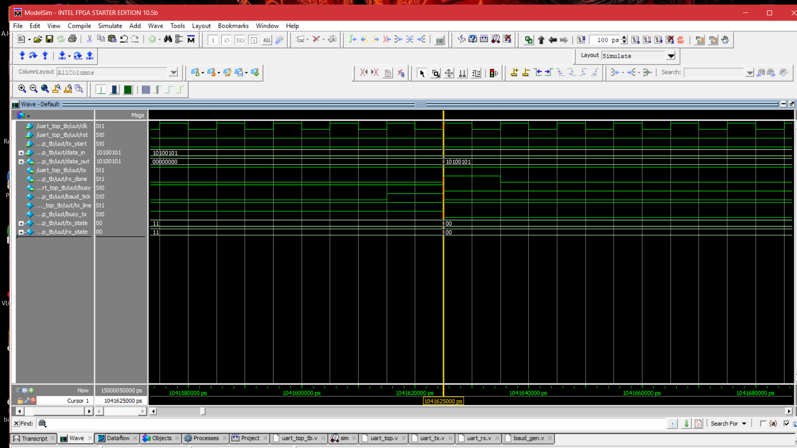
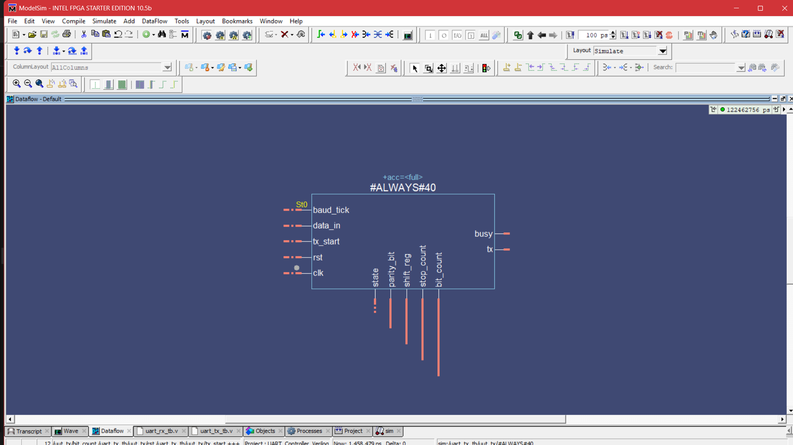
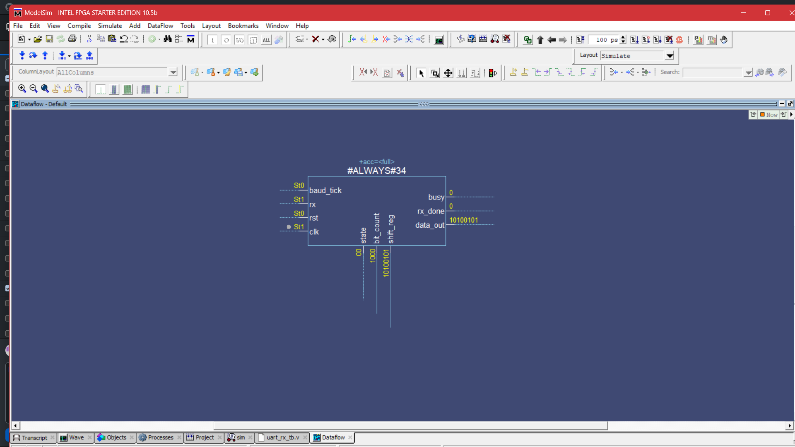

🚀 UART Controller in Verilog HDL

📖 Overview

This project presents the design and functional verification of a complete UART (Universal Asynchronous Receiver/Transmitter) Controller implemented in Verilog HDL. The design includes a Baud Rate Generator, UART Transmitter, UART Receiver, and a Top-Level Integration Module. All modules were verified through simulation using ModelSim Intel FPGA Starter Edition.

The implementation demonstrates reliable asynchronous serial communication by successfully transmitting and receiving an 8-bit data frame while validating finite state machine (FSM) transitions, baud timing, and data integrity.

---

🎯 Project Objective

The objective of this project is to design, implement, and verify a complete UART Controller using Verilog HDL. The project demonstrates asynchronous serial communication by integrating a Baud Rate Generator, UART Transmitter, UART Receiver, and a Top-Level module while validating the design through functional simulation in ModelSim.

---

✨ Features

- 8-bit UART Transmitter
- 8-bit UART Receiver
- Baud Rate Generator
- FSM-Based Design
- Modular RTL Architecture
- System-Level Integration
- End-to-End Functional Verification
- ModelSim Waveform Verification
- Dataflow Diagram Verification

---

📁 Project Structure

  ​📂 UART-Controller-Verilog/
    ​📂 rtl/ (Design Source Files)
       ​📄 baud_gen.v
       ​📄 uart_tx.v. 
       ​📄 uart_rx.v
       ​📄 uart_top.v
     ​📂 tb/ (Testbench Verification Files)
       ​📄 baud_gen_tb.v
       ​📄 uart_tx_tb.v 
       ​📄 uart_rx_tb.v
       ​📄 uart_top_tb.v
    📂 waveform/ (Simulation Waveform Logs)
       🖼️ uart_top_waveform.png
    ​📂 docs/ (Design Documentation and Diagrams)
       🖼️ uart_tx_dataflow.png
       🖼️ uart_rx_dataflow.png
    📄 README.md
​

---

⚙️ Module Description

🕐 Baud Rate Generator

- Generates the baud timing pulses required for UART communication.
- Provides synchronized baud ticks for both the transmitter and receiver.

📤 UART Transmitter

- Converts 8-bit parallel input data into serial output.
- FSM States:
  - IDLE
  - START
  - DATA
  - STOP

📥 UART Receiver

- Receives serial data and reconstructs the original 8-bit parallel data.
- FSM States:
  - IDLE
  - START
  - DATA
  - STOP

🎛️ UART Top Module

- Integrates:
  - Baud Rate Generator
  - UART Transmitter
  - UART Receiver
- Internally connects the transmitter output to the receiver input for complete system verification.

---

🏗️ Design Methodology

The UART controller follows a modular RTL design approach.

1. Baud clock generation
2. Parallel-to-serial data transmission
3. Serial data reception
4. FSM-controlled UART protocol implementation
5. Top-level integration
6. Functional verification using ModelSim

---

💻 Simulation Environment

📝 HDL Language

- Verilog HDL

🖥️ Simulation Tool

- ModelSim Intel FPGA Starter Edition 10.5b

🛠️ Code Editor

- Visual Studio Code

🌐 Version Control

- Git
- GitHub

---

✅ Functional Verification

The following functionality has been verified:

- Baud Tick Generation
- UART Transmission
- UART Reception
- FSM State Transitions
- Busy Signal Operation
- RX Done Assertion
- Data Integrity
- End-to-End UART Communication

---

🧪 Test Case

📥 Input Data

10100101 (0xA5)

📤 Expected Output

10100101 (0xA5)

🎉 Simulation Result

- Successful UART transmission
- Successful UART reception
- Correct data recovery
- RX Done successfully asserted
- FSM returned to the IDLE state
- No functional errors observed

---

📊 Results

The UART Controller successfully transmitted and received the 8-bit test data (0xA5). Simulation results confirmed correct baud timing, proper FSM transitions, accurate data integrity, and successful end-to-end communication between the UART Transmitter and UART Receiver. The design was verified through waveform analysis and dataflow visualization using ModelSim.

---

📸 Simulation Results

📈 UART Top Waveform

   

📤 UART Transmitter Dataflow

   

📥 UART Receiver Dataflow

   

---

🚀 Future Enhancements

- Configurable Baud Rate
- Parity Bit Support
- Configurable Stop Bits
- FIFO Buffer Integration
- UART Interrupt Support
- FPGA Hardware Implementation

---

📚 Learning Outcomes

Through this project, the following concepts were implemented and verified:

- RTL Design using Verilog HDL
- Finite State Machine (FSM) Design
- UART Communication Protocol
- Modular Hardware Design
- Functional Simulation
- Digital System Integration
- Waveform Analysis
- Dataflow Verification

---

👨‍💻 Author

Harshavardhan Akula

GitHub: (Add your GitHub profile link here)

---

📄 License

This project is intended for educational, academic, and learning purposes.
